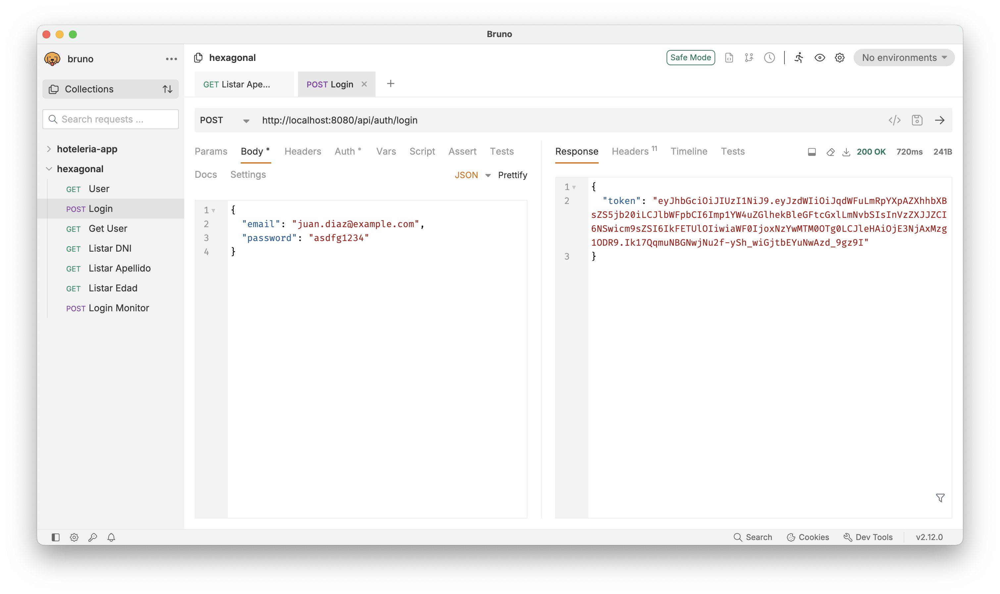
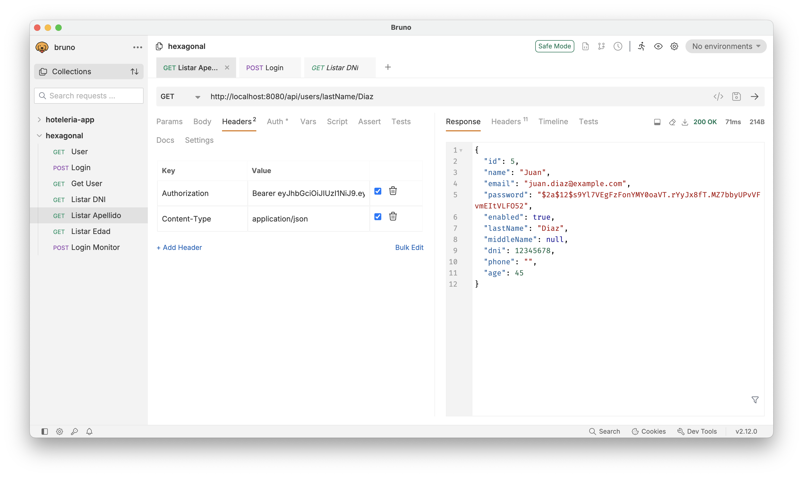
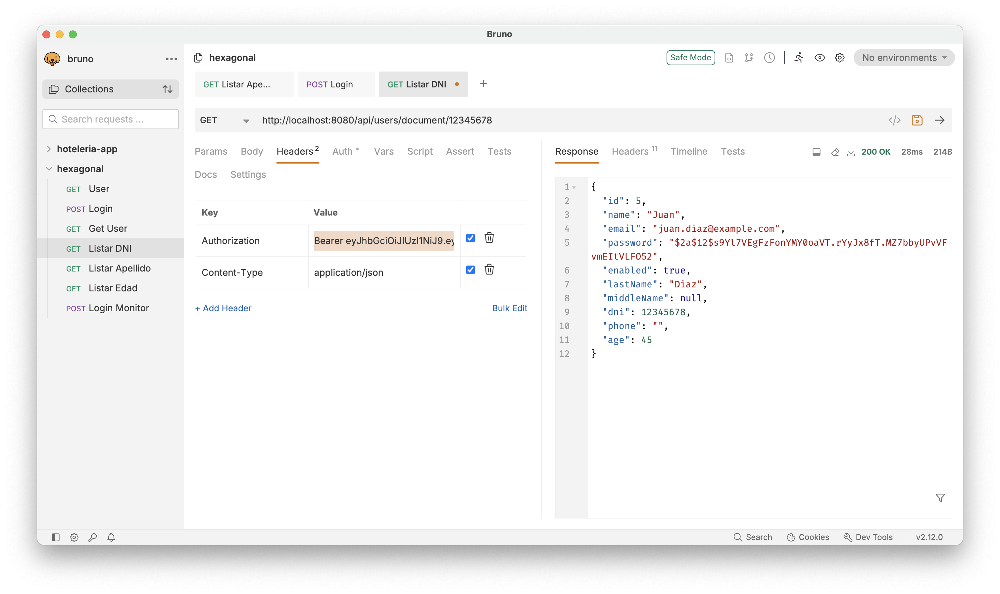
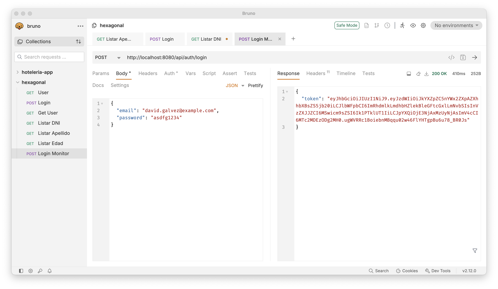
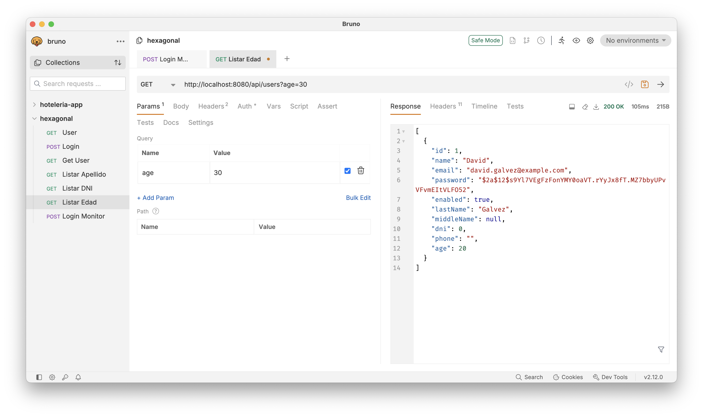

## Aplicacion Hexagonal 

### Soporta la creación y búsqueda de usuarios

### Soporte de Base de Datos MySQL
```
docker run --name mysql-hexagonal -e MYSQL_ROOT_PASSWORD=password -e MYSQL_DATABASE=hexagonal -p 3306:3306 -d mysql:8.0
```
```
docker exec -it mysql-hexagonal mysql -uroot -ppassword
```

### Tarea

Crear los campos apellido materno, edad , dni, número teléfonico

1.- 
- Modificar la lógica de creación de usuarios para que soporte los nuevos campos
- Debera buscar por apellido paterno
- Debera buscar por dni
- Debera buscar los usuarios que son menores de una edad

2.-
Debera trabajar con los siguientes roles
- ADMIN
- MONITOR
- USER

3.- 
- La busqueda por apellido paterno y dni solo podra ser realizada por ADMIN
- La busqueda por edad podra ser realizada por el MONITOR

4.- 
Realizar las pruebas de las nuevas funcionalidades

### Evidencias Tarea:
#### 1. Login role ADMIN


#### 2. Busqueda por apellido paterno para role ADMIN


#### 3. Busqueda por DNI para role ADMIN


#### 4. Login role MONITOR


#### 5. Busqueda por EDAD menor que [edad] para role MONITOR


